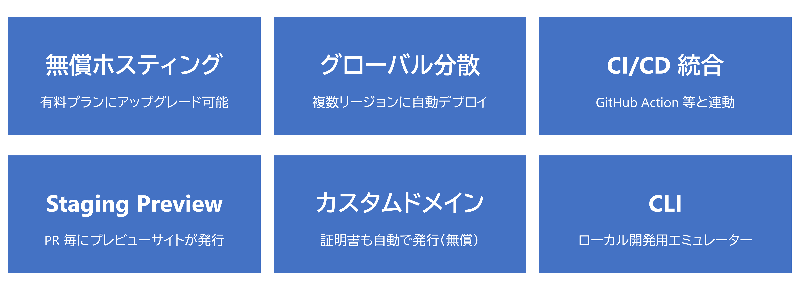
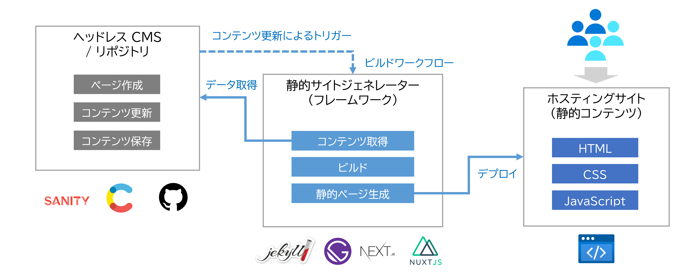

<!-- paginate: false -->

# Azure Light-up

## GitHub と Static Web Apps による Jamstack

 

###### ZEN Architects

---

<!-- paginate: true -->

## Web アプリ開発を取り巻くパラダイムシフト

- フロントエンド Web アプリの開発体験
- 静的コンテンツによるサイト配信
- Jamstack による CMS 構築・運用

---

## フロントエンド Web アプリの開発体験

### フレームワークの CLI を活用

`create-{xxx}-app` コマンドで一通りの機能が組み込まれる

- React , Vue , Next , Nuxt , Gatsby など

### ビルドスクリプトでアプリがビルドできる

`npm run build` コマンドでビルドに必要な処理が自動的に実行される

- 依存関係の解決、バンドル、ミニファイなど
- TypeScript のトランスパイル

---

## 静的コンテンツによるサイト配信

- 静的コンテンツのみでサイトを配信
- パフォーマンス、スケーラビリティ、セキュリティ面に優れる

---

## Azure Static Web Apps

- 静的サイトに最適化された Azure のホスティングサービス
- CI/CD と統合された開発体験（DX）を提供

---

## Azure Static Web Apps の基本機能

- 静的サイトホスティングに必要な基本機能はすべて揃っている

---

## CMS のパラダイムシフト

- モノリシック型（Wordpress 他）から Jamstack へ
  - 静的サイトの技術スタックを組み合わせたアーキテクチャ

---

## Jamstack の仕組み

- フレームワーク x Headless CMS x ホスティング

---

## Static Web Apps を拡張するキーテクノロジー

- Azure Functions を使った API 統合
- 認証プロバイダーとの統合による組み込み認証
- プライベートネットワーク対応

---

## Azure Static Web Apps の拡張機能

- 高度なアーキテクチャに対応する各サービスとの統合をサポート

---

## Azure Static Web Apps を活用したアーキテクチャ例

- スケーラブルでセキュアな構成もフルサーバーレスで組める時代に

---

## API (Azure Functions) の統合

- バックエンド API を同一ホストに統合できる
- 2 つの統合方式から選択可能

---

## 認証/認可の統合

- コード追加なしで主要プロバイダーの認証を組み込める
- AAD B2C 等の OIDC プロバイダーもカスタム認証で対応可能

