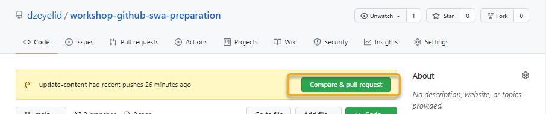

# Jamstack でコンテンツを更新する

## 記事を追加する

`Nuxt/Content` で記事を追加するには `content` ディレクトリに Markdown ファイルを作成します（ファイル名は `github.md` 等とします）。

以下のようにフロントマターと呼ばれる記事のヘッダー情報と本文から構成される Markdown ファイルを作成します。

```markdown
---
title: GitHub について
date: 2021.9.7
---

## GitHub とは

GitHub は、ユーザのみなさんからヒントを得て作成された開発プラットフォームです。

### 何ができる？

- オープンソースプロジェクトやビジネスユースまで、ソースコードをホスティングできる
- 数百万人もの他の開発者と一緒にコードのレビューを行うことができる
- プロジェクトの管理をしながら、ソフトウェアの開発を行うことができる
```

## 静的ファイルを出力する

Azure Static Web Apps には、全ての記事が静的ファイルとして出力された状態でデプロイします。そうすることで、動的な読み込みが発生せず高速で安全なサイトを構成することができます。

以下のコマンドでローカル環境で静的ファイルを出力することができます（実際には CD/CD 環境で実行される）。

```sh
npm run generate
```

`dist` ディレクトリが生成され、静的ファイルが出力されていることを確認します。

SWA CLI を使って、静的ファイルベースでの動作確認を行います。

```sh
swa start dist
```

ブラウザで記事一覧の URL `http://localhost:4280` を開いて、記事が追加されたことを確認します。

動的な構成でのアプリケーションと同じように記事が表示されてれば成功です。

## 新しいブランチを作成して push する

さて、今まで `main` ブランチで作業してきましたが、先ほど Branch protection を設定したのでもう直接コミットすることはできません。

新しいブランチを作成して、GitHub に push しましょう。

```sh
# 新しいブランチを作成する
git switch -c update-content

# 変更をコミットする
git add content/github.md
git commit

# 作成したブランチを remote に push する
git push -u origin update-content
```

## GitHub でプルリクエストを作成する

GitHub を開くと、先ほど push したブランチの変更が検知されており、プルリクエストの作成を促されます。「Compare & pull request」のボタンが選択し、プルリクエストの発行画面を開きます。



「Open a pull request」画面で、プルリクエストを作成していきます。

まず、マージする対象「base」のブランチが `main` で、比較対象「compare」のブランチが `update-content` であることを確認します。そして、下記の編集を行い、「Create pull request」ボタンからプルリクエストを作成します。

| 設定 | 説明 |
|----|----|
| タイトルや説明 | レビュアーがレビューしやすいように、わかりやすく記述することが大切です。 |
| Assignnees | 担当者を設定する。「assign yourself」で自身を設定できます。 |
| Reviewers | コントリビューターからレビュアーを指定する |


この状態で、同ブランチに更新を追加していくことも可能です。

## 記事を更新する

さらに、微細な修正を行うケースを想定して、GitHub 上でも直接 Markdown を更新してみましょう。

「Code」タブを開き、左上のブランチのプルダウンから、先ほど push したブランチ `update-content` を選択します。


そのまま GitHub リポジトリ上で、キーボードで `.` を打鍵すると、ブラウザ上でエディタが開きます。

> [Web-based editor - GitHub Docs](https://docs.github.com/ja/codespaces/developing-in-codespaces/web-based-editor)

エディタの右下のブランチの表示を確認すると、先ほど開いたブランチに切り替わった状態でエディタが開かれたことを確認できます。


それでは `cotnent/hello.md` を開き、以下のようにフロントマターに `date` 属性を追加します。

```markdown
---
title: Getting started
date: 2021.8.31
---

Empower your NuxtJS application with `@nuxtjs/content` ...（以下省略）
```

ファイルを保存したら、エディタ左メニューの Source Control アイコンから「Source Control」ビューを開き、変更をコミットします(明示的なプッシュは不要)。

1. 変更したファイルの「+」を選択し、「Staged Changed」に移動する
2. コミットメッセージを入力し、フィールドの上にある「✓」を選択してコミットする


## プルリクエストをマージする

それでは、プルリクエスト上で変更を確認してみましょう。

「Pull requests」タブから先ほど作成したプルリクエストを開いてみると、Branch protection で設定したルールが適用されていることが確認できます。


ここでは、ワークフローの「Build and Deploy Job」が正常に完了し、指定した人数以上のレビュアーから「Approve」を設定してもらえれば、マージすることができます。

「Merge pull request」を選択し、プルリクエストをマージしましょう。


マージすると `main` ブランチが更新されるので、ワークフローも再度実行されます。

`Actions` タブで CI/CD の進行状況を確認した後、Static Web App の URL で記事の変更が反映されたことを確認します。
