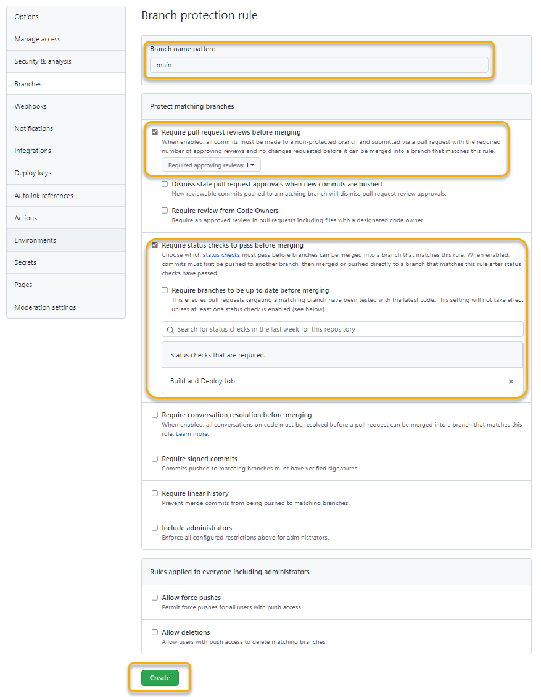

# GitHub リポジトリを安全に保つための設定を行う

GitHub では、コラボレーションして開発を進めやすくするための機能がたくさん備わっています。

ここでは、欠かせない機能の一つ Branch protection とアクセス管理についてご紹介します。

その名の通り、ブランチを保護する機能で、指定したブランチへの直接コミットを禁止し、レビュアーの承諾を要するなどの条件を設けマージの許可を制御することができます。

実際の開発では、この Branch protection を利用して、本番用のメインブランチへの意図しない変更を防ぎ、プルリクエストを用いてレビュープロセスを設けてコードの品質を担保することができます。

> - [保護されたブランチについて - GitHub Docs](https://docs.github.com/ja/github/administering-a-repository/defining-the-mergeability-of-pull-requests/about-protected-branches)
> - [Inviting collaborators to a personal repository - GitHub Docs](https://docs.github.com/ja/account-and-profile/setting-up-and-managing-your-github-user-account/managing-access-to-your-personal-repositories/inviting-collaborators-to-a-personal-repository)

## Branch protection を設定する

それではさっそく、Branch protection を設定しましょう。

まず、GitHub の「Settings」タブを開き、左のメニューから「Branch」を開きます。

「Branch protection rules」の「Add rule」ボタンを選択し、「Branch protection rule」の設定画面を開きます。ここでは、下記の設定をしましょう。

| 項目 | 説明 |
|----|----|
| Branch name patterns |  保護したいブランチ名（ここでは `main` ）を入力する。なお、「Branch name patterns」は、ワイルドカード `*` などを用いて指定することもできます。 |
| Require pull request reviews before merging | チェックをし、「Required approving reviews:」プルダウンで `1` を指定する |
| Require status checks to pass before merging | チェックをし、「Search for status checks ...」の検索フィールドで `build` と入力し、表示された「Build and Deploy Job」の候補を選択する |

設定ができたら、「Create」ボタンを選択して保存します。

## アクセスを管理する

このリポジトリの共同開発者として、コラボレーターを招待することができます。

「Settings」タブの「Manage access」を開き、「Invite a collaborator」ボタンを選択します。ここでは、講師（ @dzeyelid , @k-miyake  ）を指定し、「Add \<user name\> to this repository」ボタンから招待します。

招待された人にはメールで招待が届くので、承諾してもらうことで、コラボレーターとして参加してもらえるようになります。

