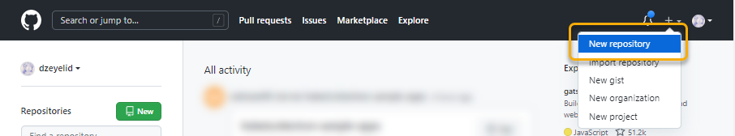
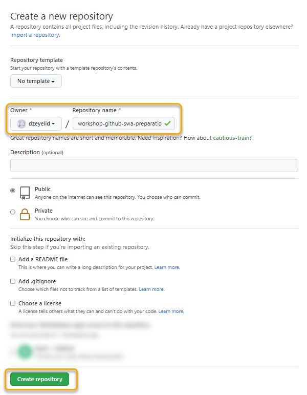
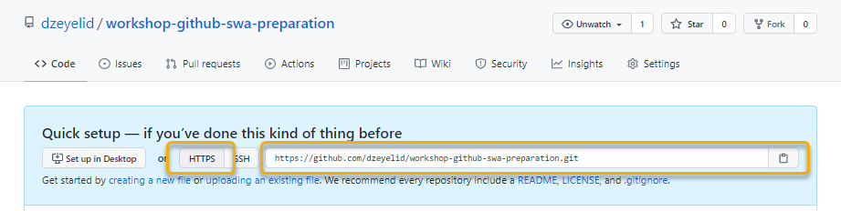

# プロジェクトを GitHub のリポジトリに push する

## プロジェクトの変更を Git で管理する

先ほど作成したプロジェクトは、作成時に `Version control system: Git` と指定したので、すでに Git でバージョン管理ができるようになっています。

まずは、ユーザー名とメールアドレスを設定しましょう。

```sh
# このプロジェクト内で利用するユーザー名とメールアドレスを設定する
git config user.name "Your Name"
git config user.email "you@example.com"
```

つぎに、 `git status` を実行して、プロジェクトの状態を見てみましょう。

```sh
git status
```

すると、このように表示され、下記のような状態であることを確認することができます。

- `master` ブランチ上にはコミットがまだない
- _Untracked files_ （追跡していないファイル）がいくつかある

```sh
On branch master

No commits yet  

Untracked files:
  (use "git add <file>..." to include in what will be committed)
        .editorconfig
        .eslintrc.js
        .gitignore
        .prettierrc
        README.md
        components/
        content/
        nuxt.config.js
        package-lock.json
        package.json
        pages/
        static/
        store/

nothing added to commit but untracked files present (use "git add" to track)
```

それでは、 `git` コマンドを利用して以下の操作を行います。

- `main` ブランチに切替える
- ファイルをステージに追加する
- ファイルをコミットする

```sh
# main ブランチに切替える
git switch -c main

# カレントディレクトリのファイルをすべてステージに追加する（※ 後述の注意をご確認ください。）
git add .

# ステージに挙げたファイルをコミットする
git commit
```

※ ディレクトリごと対象にする場合、対象のファイルがすべて意図したものであることを確認した上で実行してください。場合によっては、シークレットなどを含むローカルでしか使わないファイルごと追加してしまう危険もあります。Gitの管理に含めたくないファイルやディレクトリがある場合は `.gitignore` を活用するとよいでしょう。

`git commit` を実行すると、Git をインストールするときに指定したエディタが開き、コミットメッセージの編集を求められます。任意のメッセージを入力し保存すると、コミットが完了します。（空のままではコミットできません。）

## GitHub にリポジトリを用意する

プロジェクトの準備ができたら、つぎは GitHub でプロジェクトを管理するために、リポジトリを作成しましょう。

GitHub (github.com) を開き、右上の「+」から「New repository」を選択して新しいリポジトリの作成に進みます。



「Owner」を指定し、「Repository name」に任意のリポジトリ名を入力しましょう。（`workshop-github-swa` など）

また、Description やリポジトリのビジビリティ（ Public or Private ）、よく使うファイルの生成などを指定することができます。今回は、すでにプロジェクトを作成済みなので空の状態のまま進めますが、用途に応じて `README` や `LICENSE` ファイルを同時に作成しておくと新しくプロジェクトを始めるときに便利です。

設定できたら「Create repository」ボタンからリポジトリを作成します。



リポジトリの作成が完了すると、次の操作の案内が表示されます。

リポジトリの remote URL が表示されているので、コピーしておきます。



## `remote` にリポジトリを設定し、プッシュする

リポジトリの作成が完了したら、プロジェクトの `remote` に GitHub のリポジトリを設定し、push して管理状態を反映しましょう。

プロジェクトのディレクトリで、下記を実行します。

```sh
# remote に origin という名前で GitHub のリポジトリを設定する
git remote add origin <リポジトリの remote URL>

# main ブランチを origin に push する
git push origin main
```

`git push` の実行が終わると、GitHub のリポジトリに push した内容が反映されていることが確認できます。（反映されない場合は、ページをリロードしてみてください。）